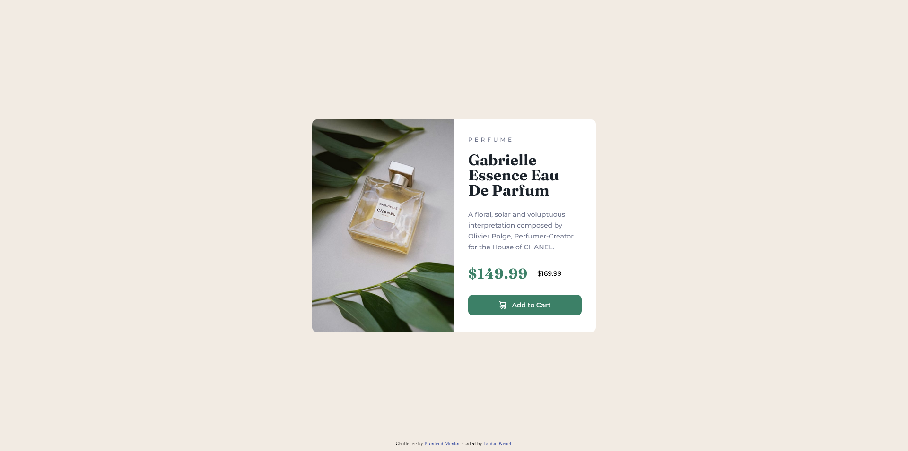

# Frontend Mentor - Product preview card component solution

This is a solution to the [Product preview card component challenge on Frontend Mentor](https://www.frontendmentor.io/challenges/product-preview-card-component-GO7UmttRfa). Frontend Mentor challenges help you improve your coding skills by building realistic projects. 

## Table of contents

- [Overview](#overview)
  - [The challenge](#the-challenge)
  - [Screenshot](#screenshot)
  - [Links](#links)
- [My process](#my-process)
  - [Built with](#built-with)
  - [What I learned](#what-i-learned)
  - [Continued development](#continued-development)
- [Author](#author)

## Overview

### The challenge

Users should be able to:

- View the optimal layout depending on their device's screen size
- See hover and focus states for interactive elements

### Screenshot

### Links

- Solution URL: [Add solution URL here](https://jordankisiel.github.io/product-preview-card-component-main/)

## My process

### Built with

- Semantic HTML5 markup
- CSS variables
- Flexbox
- Grid

### What I learned

I took a desktop first approach to styling this project but I found this to be a bit awkward and unintuitive so next time I'll try a mobile-first approach

### Continued development

I want to continue working with CSS grids to get some practice and muscle memory as well as expand my knowledge of them. Additionally, I'd like do more responsive media query design to see if I can develop some more intuition about how best to approach it.

## Author

- Website - [Jordan Kisiel](https://robojojo.co/)
- Frontend Mentor - [@JordanKisiel](https://www.frontendmentor.io/profile/JordanKisiel)
- Twitter - [@JordanKisiel](https://www.twitter.com/JordanKisiel)

